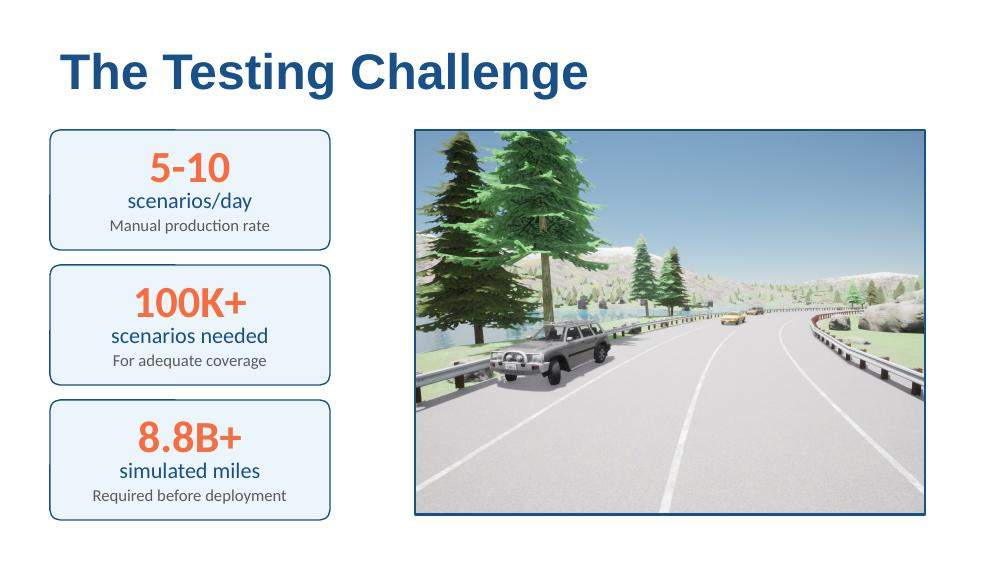
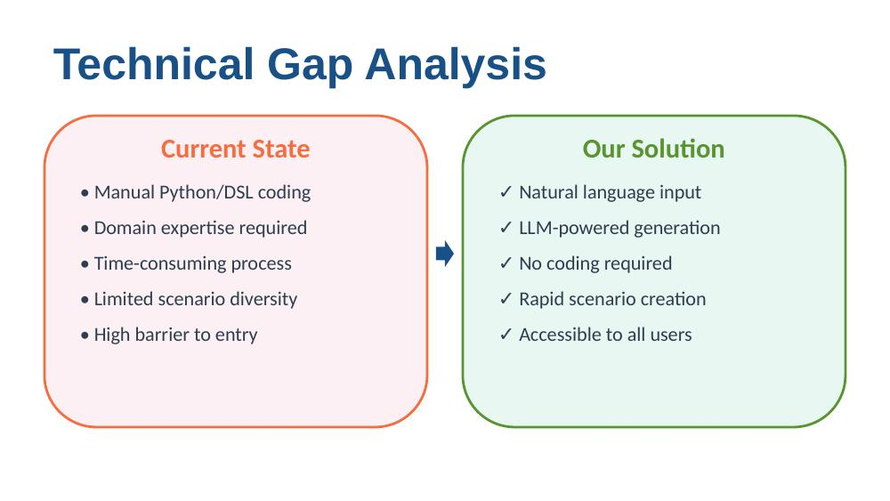
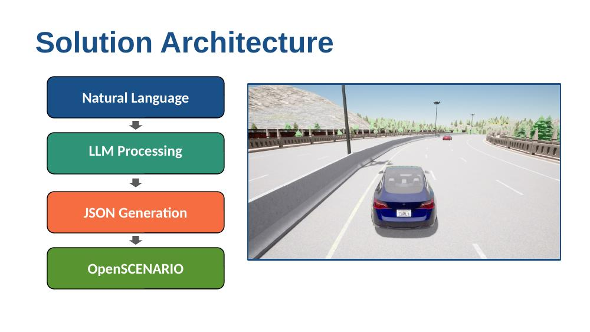
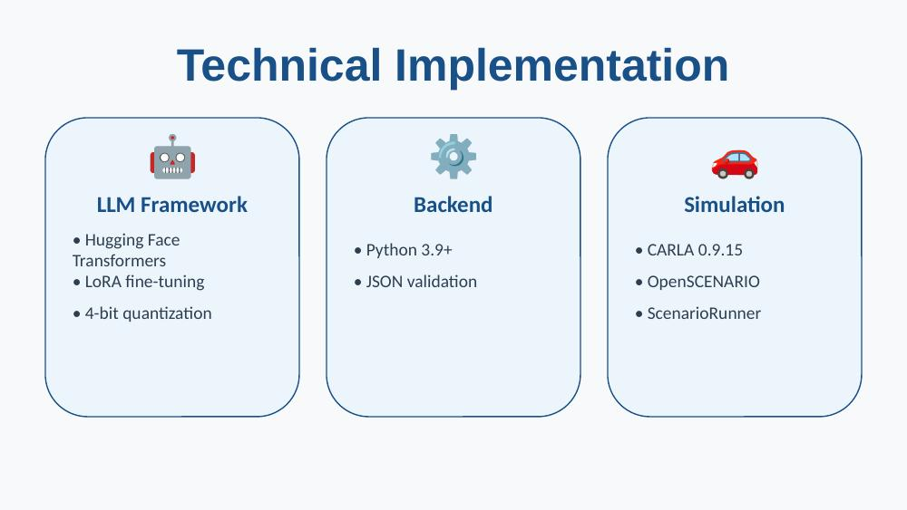
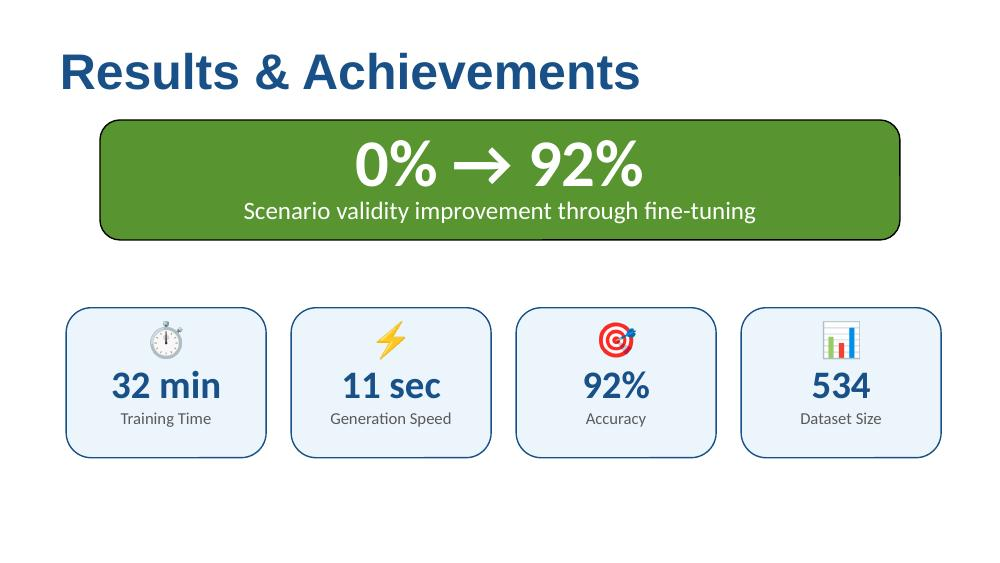
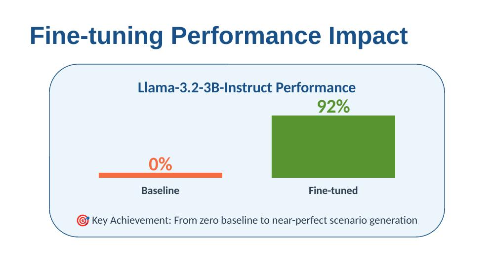
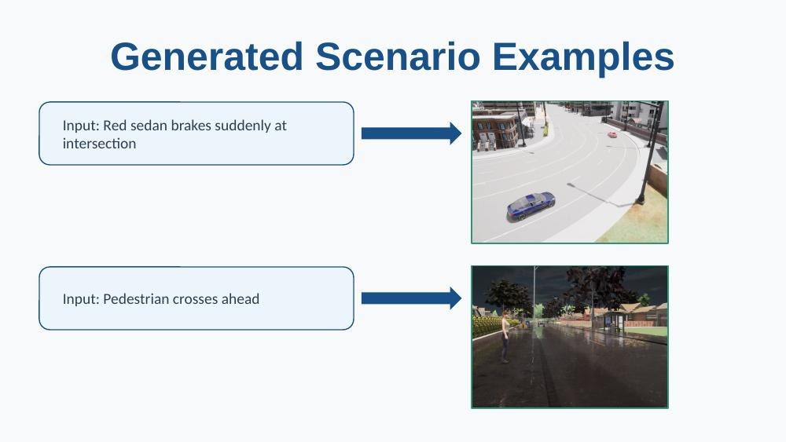
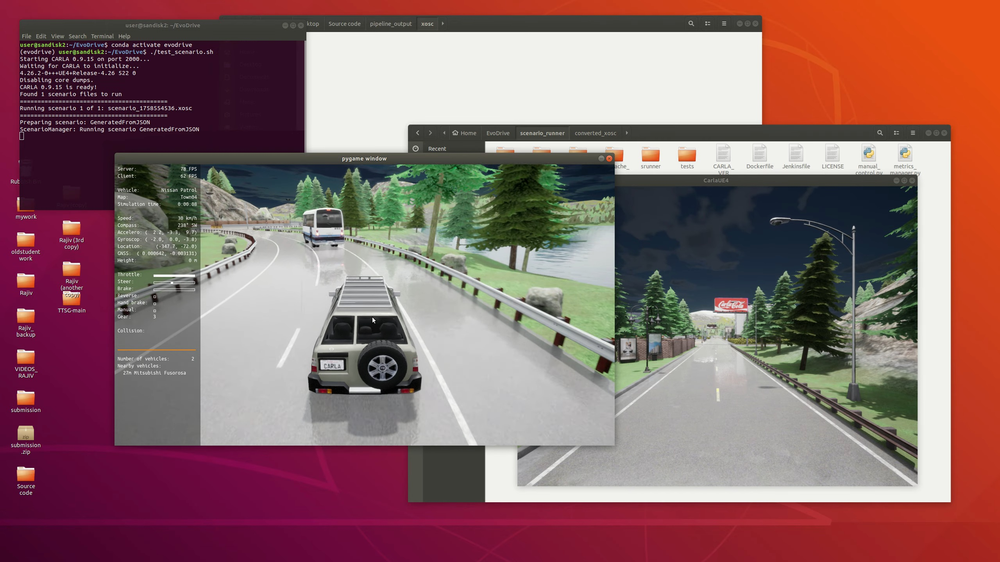

# Natural Language → CARLA Scenario Generation

A Python pipeline that turns natural-language driving descriptions into executable [CARLA](https://carla.org/) simulation scenarios via a fine-tuned LLM, intermediate JSON, and [OpenSCENARIO](https://www.asam.net/standards/detail/openscenario/) (XOSC).

MSc Artificial Intelligence project, Loughborough University.

---

## Why this exists

Autonomous vehicle developers need enormous scenario libraries to validate their stacks, but hand-authoring them doesn't scale.



Manual authoring tops out at 5–10 scenarios per engineer per day, while credible coverage targets sit in the hundreds of thousands. This project closes that gap by letting a domain expert (or anyone) describe a scenario in English and get back a valid, runnable XOSC file in seconds.



---

## Pipeline

The system is a four-stage pipeline. The repository in this folder implements stages 3 and 4; stage 2 is a fine-tuned Llama-3.2-3B-Instruct served separately.



1. **Natural language input** from the user ("Red sedan brakes suddenly at intersection")
2. **LLM processing** — fine-tuned model emits a flat JSON scenario
3. **JSON → OpenSCENARIO conversion** — `xosc_json.py` validates the JSON and renders an XOSC file
4. **Execution in CARLA** via ScenarioRunner

---

## Repository structure

```bash
├── xosc_json.py                    # Main JSON → XOSC converter
├── spawn_meta.py                   # CARLA spawn-point metadata extractor
├── scenario_*.json                 # 200+ example scenario definitions
├── scenario_*.txt                  # Natural-language prompts matched to each JSON
├── enhanced_Town01.json            # Town01 spawn/road metadata
├── OpenSCENARIO.xsd                # Schema for XOSC validation
├── environment.yml                 # Conda environment (converter)
├── llm310_environment.yml          # Conda environment (LLM fine-tuning, Python 3.10)
├── scenario_runner_requirements.txt
├── requirements.txt
└── readme.md
```

The `scenario_*` files cover eight categories — car following, lane change, pedestrian crossing, weather/visibility, static obstacles, vulnerable road users, emergency priority, and multi-actor — each with a matched `.txt` prompt and `.json` target.

---

## Features

- **JSON → XOSC conversion** from a flat, LLM-friendly schema to fully compliant OpenSCENARIO XML
- **Schema validation** against both the JSON schema and the official OpenSCENARIO XSD
- **CARLA catalog support** for vehicles, pedestrians, weather presets, and map validation
- **Action library**: `speed`, `stop`, `wait`, `lane_change`, and more
- **Trigger library**: `time`, `distance_to_ego`, `after_previous`
- **Tunable dynamics**: `dynamics_dimension`, `dynamics_shape`, `dynamics_value` for smooth transitions

---

## Tech stack



- **LLM**: Llama-3.2-3B-Instruct, LoRA fine-tuned in 4-bit via Hugging Face Transformers
- **Backend**: Python 3.9+, JSON Schema validation, lxml
- **Simulation**: CARLA 0.9.15, OpenSCENARIO, ScenarioRunner

---

## Results

The fine-tuned model went from producing zero valid scenarios at baseline to 92% validity after 32 minutes of training on 534 examples (single RTX 3090). End-to-end generation takes ~11 seconds per scenario.





---

## Prerequisites

- Python 3.7+ (converter tested on 3.7; LLM stack needs 3.10)
- `xmlschema`, `jsonschema`, `lxml`
- CARLA 0.9.15 + ScenarioRunner (for execution only)

```bash
pip install jsonschema xmlschema lxml
```

Or use the provided conda environments:

```bash
conda env create -f environment.yml           # converter
conda env create -f llm310_environment.yml    # LLM fine-tuning
```

---

## Usage

### 1. Prepare a JSON scenario

Either write one by hand against the schema, or have the fine-tuned LLM generate it from a natural-language prompt. See any `scenario_*.json` / `scenario_*.txt` pair for matched examples.

### 2. Convert to OpenSCENARIO

```bash
python xosc_json.py scenario_001_basic_following.json -o scenario_001.xosc
```

This validates the JSON against the schema and writes a pretty-printed XOSC file.

### 3. Run in CARLA

```bash
./scenario_runner.py --openscenario scenario_001.xosc --reloadWorld --output
```

Ensure the CARLA server is running on port `2000`.

---

## Example scenarios

The fine-tuned model handles both mundane and adversarial cases. Two from the presentation demo:



### Minimal JSON input

```json
{
  "scenario_name": "PedestrianCrossingFront",
  "map_name": "Town01",
  "ego_start_position": "150,55,0,180",
  "actors": [
    {
      "id": "adversary",
      "type": "pedestrian",
      "model": "walker.pedestrian.0001",
      "start_position": "110,52,0.3,90"
    }
  ],
  "actions": [
    {
      "actor_id": "adversary",
      "action_type": "speed",
      "trigger_type": "distance_to_ego",
      "trigger_value": 40,
      "speed_value": 10.0
    },
    {
      "actor_id": "adversary",
      "action_type": "stop",
      "trigger_type": "after_previous"
    }
  ],
  "success_distance": 200,
  "timeout": 60,
  "collision_allowed": false
}
```

### Generated XOSC snippet

```xml
<Story name="MyStory">
  <Act name="Behavior">
    <ManeuverGroup maximumExecutionCount="1" name="adversaryManeuverGroup">
      <Actors selectTriggeringEntities="false">
        <EntityRef entityRef="adversary"/>
      </Actors>
      <Maneuver name="adversaryManeuver">
        <Event name="adversaryEvent0" priority="overwrite">
          <Action name="adversaryAction0">
            <PrivateAction>
              <LongitudinalAction>
                <SpeedAction>
                  <SpeedActionDynamics dynamicsDimension="time" dynamicsShape="step" value="0"/>
                  <SpeedActionTarget>
                    <AbsoluteTargetSpeed value="10.0"/>
                  </SpeedActionTarget>
                </SpeedAction>
              </LongitudinalAction>
            </PrivateAction>
          </Action>
          <StartTrigger>…</StartTrigger>
        </Event>
      </Maneuver>
    </ManeuverGroup>
  </Act>
</Story>
```

---

## Demo

<!--
Tutorial video placeholder. Once recorded, either:
 - embed a thumbnail linked to YouTube:
     [](https://youtu.be/YOUR_VIDEO_ID)
 - or drop short GIF clips into images/ and inline them per step below.
-->

End-to-end flow shown in the demo video:

[](https://youtu.be/I1znubiJYgo)

---

## Limitations and future work

- **Scope**: limited to urban driving scenarios; highway and off-road untested
- **Complexity**: reliably handles 2–3 entities; many-actor scenes degrade
- **Partial trigger/action coverage**: extended triggers (e.g. `reach_position`) not yet implemented
- **No scene-graph validation**: assumes CARLA maps and catalogs exist and are correctly referenced
- **Next steps**: larger synthetic datasets, adversarial scenario mining, support for Town03/Town05

---

## Contributing

Issues and pull requests welcome — particularly for new action types, trigger conditions, and schema extensions.
